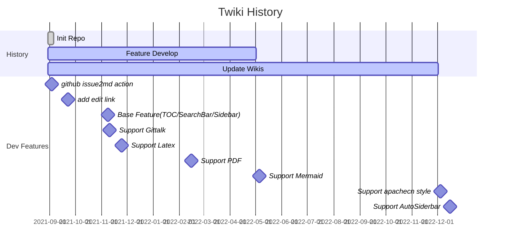

-----

| Title     | Features                                            |
| --------- | --------------------------------------------------- |
| Created @ | `2021-11-21T09:15:37Z`                              |
| Updated @ | `2024-06-12T06:43:36Z`                              |
| Labels    | `Features, reindex`                                 |
| Edit @    | [here](https://github.com/junxnone/twiki/issues/16) |

-----

# twiki Features

## [Issue to markdown](https://github.com/junxnone/wiki_issue2md)

  - Auto convert the issue to markdown docs

## [Edit link](https://github.com/junxnone/wiki_issue2md/blob/main/action.yml#L67)

  - Add <kbd>Edit</kbd> Button, link to the issue

## [Markdown Format](/0017_Features_Markdown)

  - 支持大部分 Github markdown format

### 对齐

  - **居中对齐**

<!-- end list -->

    <p align="center ">Here is left</p>

<p align="center ">Here is center</p>  

  - **左对齐**

<!-- end list -->

    <p align="left">Here is left</p>

<p align="left">Here is left</p>

  - **右对齐**

<!-- end list -->

    <p align="right">Here is right</p>

<p align="right">Here is right</p>

### superscript & subscript

    Text Line<sup>superscript</sup>
    Text Line<sub>subscript</sub>

Text Line<sup>superscript</sup>  
Text Line<sub>subscript</sub>

### 转义字符

    \* \` \|

\* \` |

### 引用

    > 1级引用
    >> 2级引用
    >>> 3级引用

> 1级引用
> 
> > 2级引用
> > 
> > > 3级引用

### Code 引用

Github issues markdown 引用 code 只能是本repo的code，且只能在本 repo 所属的 issue
或markdown 显示 例如

<https://github.com/junxnone/wiki/blob/cbdf0ee17452e221607ae78b5e1ecb5af546cf94/index.04eb6053.js#L5-L7>

  - 可以使用 [emgithub 工具](https://junxnone.github.io/emgithub/)生成 `script`
    或 `iframe`

<iframe frameborder="0" scrolling="no" style="width:100%; height:142px;" allow="clipboard-write" src="https://junxnone.github.io/emgithub/iframe.html?target=https%3A%2F%2Fgithub.com%2Fjunxnone%2Fwiki%2Fblob%2Fcbdf0ee17452e221607ae78b5e1ecb5af546cf94%2Findex.04eb6053.js%23L5-L7&style=agate&type=code&showBorder=on&showLineNumbers=on&showFileMeta=on&showFullPath=on&showCopy=on"></iframe>

### 折叠

    <details>
    <summary>折叠世界</summary>
    Hello， 这里是折叠世界
    
    ```
    Code
    Code
    ```
    
    </details>

<details>
<summary>折叠世界</summary>
Hello， 这里是折叠世界

    Code
    Code

</details>

### Keyboard 格式

    <kbd>ctrl</kbd> + <kbd>c</kbd>

<kbd>ctrl</kbd> + <kbd>c</kbd>

### Text Color

``` 
-  `#f03c15` 红
-  `#c5f015` 黄 
-  `#1589F0` 蓝
-  
```

  - 
    `#f03c15` 红
  - 
    `#c5f015` 黄
  - 
    `#1589F0` 蓝
  - 

<!-- end list -->

    ```diff
    - text in red
    + text in green
    ! text in orange
    # text in gray
    ```

``` diff
- text in red
+ text in green
! text in orange
# text in gray
```

### 引用文献(not supported by docsify??)

提到的文献 \[^papers\_1\]  
提到的文献 \[^papers\_2\]  
提到的文献 \[^papers\_3\]

\[^papers\_1\]: 引用文献 xxxxx\_1  
\[^papers\_2\]: 引用文献 xxxxx\_2  
\[^papers\_3\]: 引用文献 xxxxx\_3

## Latex Math

  - [docsify-latex
    MathJax](https://scruel.github.io/docsify-latex/#/?id=with-mathjax)
  - [docsify-latex
    KaTex](https://scruel.github.io/docsify-latex/#/?id=with-katex)

| `$\texttt{accuracy}(y, \hat{y}) = \frac{1}{n_\text{samples}} \sum_{i=0}^{n_\text{samples}-1} 1(\hat{y}_i = y_i)$` | $\\texttt{accuracy}(y, \\hat{y}) = \\frac{1}{n\_\\text{samples}} \\sum\_{i=0}^{n\_\\text{samples}-1} 1(\\hat{y}\_i = y\_i)$ |
| ----------------------------------------------------------------------------------------------------------------- | --------------------------------------------------------------------------------------------------------------------------- |
| % Github Markdown<br> `$\\%$`                                                                                     | $\\%$                                                                                                                       |
| % docsify <br> `$\%$`                                                                                             | $%$                                                                                                                         |

Details Please Refer
[here](https://junxnone.github.io/docsify-katex/docs/#/supported)

### 字体大小

| label          | show                          |
| -------------- | ----------------------------- |
| \\tiny         | $\\tiny tiny$                 |
| \\scriptsize   | $\\scriptsize scriptsize$     |
| \\footnotesize | $\\footnotesize footnotesize$ |
| \\small        | $\\small small$               |
| \\normalsize   | $\\normalsize normalsize$     |
| \\large        | $\\large large$               |
| \\Large        | $\\Large Large$               |
| \\LARGE        | $\\LARGE LARGE$               |
| \\huge         | $\\huge huge$                 |
| \\Huge         | $\\Huge Huge$                 |

-----

[online latex
editor](https://junxnone.github.io/m/ ":include :type=iframe width=100% height=600px")

-----

[katex
Support](https://junxnone.github.io/docsify-katex/docs/#/supported ":include :type=iframe width=100% height=1200px")

## Include Content

### wikilink

\[\[hist\]\]

### Include doc

    [update](hist.md ':include')

\--- Included docs start ---

[update](hist.md ":include")

\--- Included docs end ---

### Include code

    [update](hist.md ':include :type=code')

[update](hist.md ":include :type=code")

### Include gist

    [gist: hello_openmp](https://gist.githubusercontent.com/junxnone/9af88e64446fb0746ebfb1e0e8879f33/raw/2d04dcd1fd3ac51988d3e756bb1be477efe02216/openmp_helloworld.cpp ':include :type=code')

  - 如果要使用 `gist` 的最新内容需要 把 `commit id` 移除

<!-- end list -->

    https://gist.githubusercontent.com/junxnone/9af88e64446fb0746ebfb1e0e8879f33/raw/openmp_helloworld.cpp

[gist:
hello\_openmp](https://gist.githubusercontent.com/junxnone/9af88e64446fb0746ebfb1e0e8879f33/raw/openmp_helloworld.cpp ":include :type=code")

### Include pdf file

  - **plugin**
    [docsify-pdf-embed](https://github.com/lazypanda10117/docsify-pdf-embed)

<!-- end list -->

``` pdf
flann_docs.pdf
```

### include embed iframe

#### Include webpage

    [junxnone website](https://junxnone.github.io ':include :type=iframe width=100% height=1200px')

[junxnone
website](https://junxnone.github.io ":include :type=iframe width=50% height=1200px")

#### Include Google Docs

[google
sheet](https://docs.google.com/spreadsheets/d/e/2PACX-1vTYDn4ZEG4oc2kFYlUpdY2N8yNwptVKC7MwwE9IEs2hfZFsOPsI7yeEDoVuabtUuN-HedNe6mP_eXj-/pubhtml?gid=232973174&single=true&widget=true&headers=false ":include :type=iframe width=100% height=800px")

#### Include 交互图片

[fg](https://github.com/junxnone/twiki/assets/2216970/a71cc2f9-924c-4b34-89a0-89c6909ff362 ":include :type=iframe width=100% height=600px")

#### Include Code Line

  - <https://emgithub.com/>
  - <https://junxnone.github.io/emgithub/>

<script src="https://emgithub.com/embed-v2.js?target=https%3A%2F%2Fgithub.com%2Fjunxnone%2Ftwiki%2Fblob%2F42f7df84f3383fcea0658d253a8d6b833e7e4a64%2Fdocs%2Findex.html%23L20-L28&style=default&type=code&showBorder=on&showLineNumbers=on&showFileMeta=on&showFullPath=on&showCopy=on"></script>

<script src="https://emgithub.com/embed-v2.js?target=https%3A%2F%2Fgithub.com%2Fjunxnone%2Ftwiki%2Fblob%2F42f7df84f3383fcea0658d253a8d6b833e7e4a64%2Fdocs%2Findex.html%23L58-L59&style=base16%2Fgithub&type=code&showBorder=on&showLineNumbers=on&showFileMeta=on&showFullPath=on&showCopy=on"></script>

<script src="https://junxnone.github.io/emgithub/embed-v2.js?target=https%3A%2F%2Fgithub.com%2Fjunxnone%2Ftwiki%2Fblob%2Fa0fe3683bcd638acb43d88142acef3e68e4aad23%2Fdocs%2F0013_Features_IncludeContent.md%3Fplain%3D1%23L83-L85&style=default&type=code&showBorder=on&showLineNumbers=on&showFileMeta=on&showFullPath=on&showCopy=on"></script>


## Mermaid 图表支持

  - [mermaid-docsify](https://github.com/Leward/mermaid-docsify)
  - [Mermaid js](https://mermaid-js.github.io/mermaid/#/)
  - [mermaid-live-editor](https://mermaid-js.github.io/mermaid-live-editor)

-----

    gantt
        title Twiki History
        dateFormat  YYYY-MM-DD
        section History
        Init Repo           :done, 2021-08-30, 1w
        Feature Develop     :active, 2021-08-30, 2022-05-02
        Update Wikis        :active, 2021-08-30, 2022-12-02
        section Dev Features
        github issue2md action :milestone, 2021-08-31, 1w
        add edit link       :milestone, 2021-09-19, 1w
        Base Feature(TOC/SearchBar/Sidebar) :milestone, 2021-11-05, 1w
        Support Gittalk     :milestone, 2021-11-07, 1w
        Support Latex       :milestone, 2021-11-21, 1w
        Support PDF         :milestone, 2022-02-11, 1w
        Support Mermaid     :milestone, 2022-05-02, 1w
        Support apachecn style     :milestone, 2022-12-01, 1w
        Support AutoSiderbar   :milestone, 2022-12-12, 1w



## Others Plugin

  - [Sidebar
    Collapse](https://github.com/iPeng6/docsify-sidebar-collapse)
  - [Code Copy Button](https://github.com/jperasmus/docsify-copy-code)
  - [TOC](https://github.com/justintien/docsify-plugin-toc)
  - [Search Bar](https://docsify.js.org/#/plugins?id=full-text-search)
  - [Count Word](https://github.com/827652549/docsify-count)
  - [Dark
    Mode](https://github.com/boopathikumar018/docsify-darklight-theme)
  - [Gittalk Comment](https://github.com/gitalk/gitalk)
